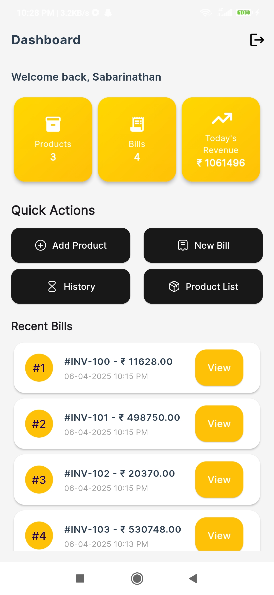
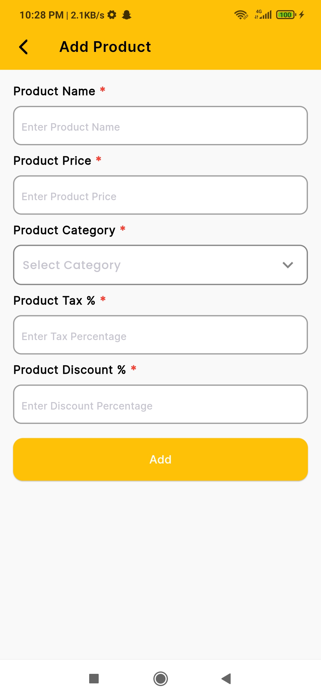
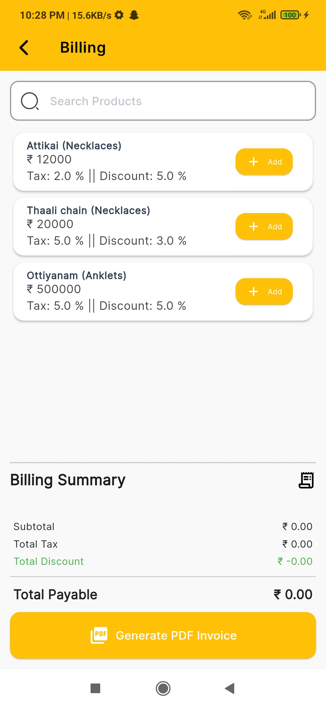

# 💎 Jewel Management

Jewel Management is a lightweight Flutter application designed for local Jewellery billing and inventory. It offers essential features like product CRUD, invoice generation with PDF export, billing history, and basic authentication — all powered by local storage via SharedPreferences.

---

## 🚀 Features

- 🛍️ **Product Management**  
  Add, update, delete jewellery products with category, price, tax, and discount.

- 🧾 **Billing System**

  - Add products to bill
  - Automatic tax & discount calculation
  - PDF invoice generation

- 🗃️ **Billing History**  
  Tracks and stores all generated invoices locally.

- 🔐 **User Session**  
  Simple login/logout using SharedPreferences.

- 📄 **PDF Invoice**  
  Professional-style PDF with bill summary, tax, discount, and cashier signature section.

- 🧠 **GetX State Management**  
  Efficient and clean architecture using GetX for routing, state, and controller management.

---

## 🧱 Tech Stack

| Tech          | Use Case                      |
| ------------- | ----------------------------- |
| Flutter       | App development               |
| Dart          | Programming language          |
| GetX          | State management & navigation |
| GetStorage    | Local data storage            |
| uuid          | Unique product ID generation  |
| screenutil    | Responsive layout             |
| path_provider | File access for PDF saving    |
| pdf           | Invoice generation            |

---

## 📸 Screenshots

### 🏠 Dashboard



### ➕ Add Product



### 🧾 Billing Page



---

## 📂 Folder Structure

lib/
├── Controller/ # All GetX controllers
├── Model/ # Data models
├── Theme/ # Colors, Fonts, AppTheme
├── View/
│ ├── Screens/ # UI Screens
│ ├── util/ # Search bar, utility widgets
│ ├── widgets/ # Reusable widgets
├── main.dart # Entry point

---

## 🛠️ Setup Instructions

1. **Clone the Repo**

   ```bash
   git clone https://github.com/Sabarinathan-R/Jewellery-Management.git
   cd jewel-management
   ```

````

2. **Install Dependencies**

   ```bash
   flutter pub get
   ```

3. **Run the App**

   ```bash
   flutter run
   ```

4. **Build APK (Optional)**
   ```bash
   flutter build apk --release
   ```

---

## 🧪 Testing

- Test product CRUD from the dashboard.
- Create a new bill, verify PDF generation.
- Check history for saved invoices.
- Log out and re-login to test session handling.

---

## 📋 Todo / Future Enhancements

- Cloud sync via Firebase or Supabase
- Barcode/QR Scanner support
- Product image and stock tracking
- Export billing history to Excel

---

## 🙌 Credits

Developed by [Sabarinathan R](https://github.com/Sabarinathan-R)
🧠 Team Coordinator & Project Architect @ Nulinz

---

## 📃 License

This project is licensed under the MIT License - see the [LICENSE](LICENSE) file for details.
````
